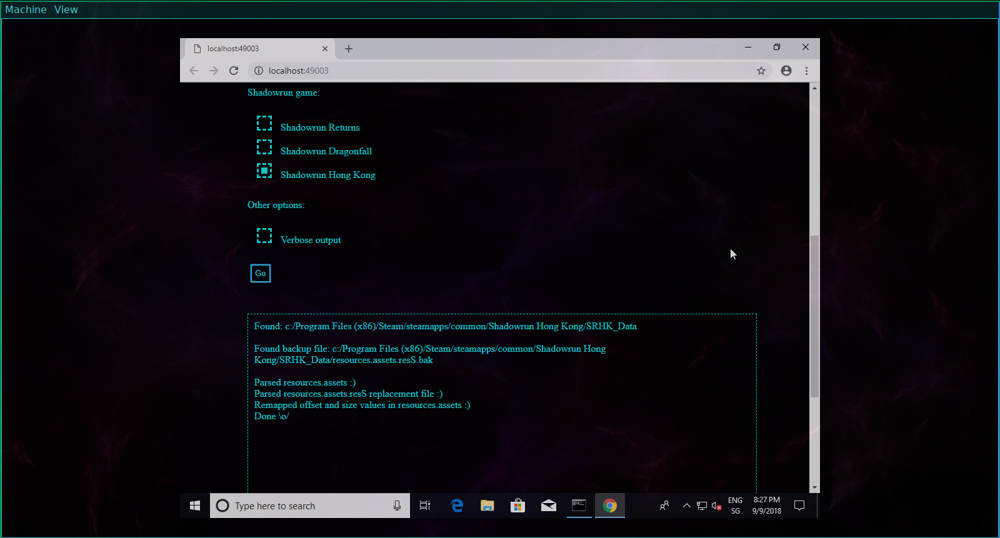
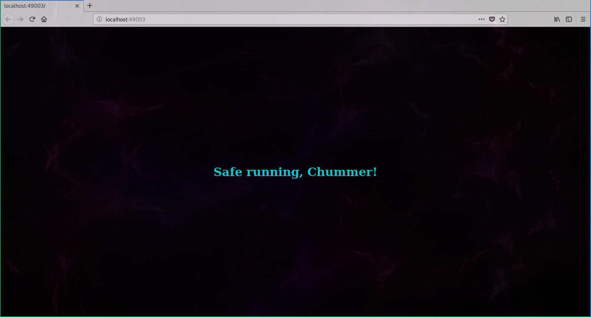

# Shadow-Tune
Perl script to swap out the soundtrack of Harebrained Scheme's Shadowrun games with custom music. 

[Prerequisites](#prerequisites)

[Installation](#installation)

[How to Launch](#launching)

[Usage](#usage)

[Screenshots](#screenshots)

[Limitations](#limitations)

Need more documentation? Visit the [wiki](https://github.com/Van-Ziegelstein/Shadow-Tune/wiki)!

## What is this exactly?
At its core, *Shadow-Tune* is a tool to manipulate the music resource files of the three
Shadowrun Games released by Harebrained Schemes:

- *Shadowrun Returns*
- *Shadowrun Dragonfall*
- *Shadowrun Hong Kong*

All three games store their music in a file named `resources.assets.resS`, with corresponding
metadata saved in another file labeled `resources.assets`. Users wishing to replace the soundtrack
with something else will have to overwrite the `resources.assets.resS` file with a new one and 
update the aforementioned metadata.

*Shadow-Tune* aims to automate this replacement process. However, it is **not** a music converter and it is
up to the user to provide a properly formatted `resources.assets.resS` file. (More information on how to create
a custom version of this file can be found in the [wiki](https://github.com/Van-Ziegelstein/Shadow-Tune/wiki/FAQ)!)

**Important:**

This is the experimental gui version. It uses a local server and a browser-based interface (if an html form
can already be called such) to hide the nasty commandline stuff. Development is still under way.

## Why does this exist?
*Shadow-Tune* `1.0` was originally developed as part of the effort to bring the UGC campaign [CalFree in Chains](https://steamcommunity.com/sharedfiles/filedetails/?id=1239356669)
(which every self-respecting Shadowrunner should play if he/she/it hasn't already) to Linux platforms. The mod came with its
own soundtrack and a Linux-specific solution was needed to properly apply it and restore vanilla behavior once finished with the campaign.

This branch came into existence when the maintainer contemplated the secrets of bad gui design and decided to open Pandora's Box.

Shadowrunners unite! (Or maybe it would be wiser to flee?)

## Prerequisites
- A Perl interpreter, preferably `>= 5.26.2`.
Most Linux and Unix flavors should come with one pre-installed. Windows users might want to give [Strawberry Perl](http://strawberryperl.com/) or [ActivePerl](https://www.activestate.com/activeperl) a try. (**Note: Only Strawberry Perl has been tested so far. See [Limitations](#limitations) for further information.**)

## Installation
There are no releases yet. If you really want to try this out, then clone the repo. Stability is not guaranteed!

## Launching

### Linux and Mac
The main script is named "shadow_tune.pl". Depending on the desktop environment, launching it with a simple click might be
possible. If that's not an option, you'll need to swallow the bitter pill and
open a terminal.

### Windows
The source files contain a batch script. After unzipping, navigate to the "windows" folder
and double-click the file (Windows will question its safety and given the twisted mind of 
Shadow-Tune's maintainer it is probably right). 
The script will check for a Perl interpreter and launch the main program afterwards.
(A command prompt will open. Don't be afraid.)

## Usage

### Console
Since the main interaction with the user is meant to happen in the gui instead of the
console, the commandline parameters are more limited.

Currently there are two options:

* `-p <port number>`
Specify an alternate port for the server to listen on. (Default is 49003.)

* `--help`
Print the help dialogue to the console.

### Gui 
Most of the settings in the web interface should be self-explanatory. Here's a breakdown
of the more important ones:

* `Path to Shadowrun game folder` This field can be used to enter the path to 
the Shadowrun game that is to be modified. Shadow-Tune comes with a collection of platform-specific
default paths, and if the field is left empty, the script will fall back to those.

* `New resources.assets.resS file` This is the path to the resources.assets.resS file that
the user wishes to use as replacement. Filling out this field is **required**.

* `Go` Clicking on this button will start the replacement/restore operation (provided none of the
required fields are empty). If everything goes well, a box showing the program log
should appear below the input fields. Due to some quirks of the HTTP standard this is not a "live"
depiction of the replacement process. Rather, the log box is updated once all files have been parsed
and rewritten. This is in contrast to the commandline version from the master branch. The delay between
clicking and seeing output might be significant. **Do not** refresh the page after clicking on the button,
as this might mangle a response from the server.

* `Action` Use the buttons to choose between one of the actions:

  - Replace: Update the soundtrack of the requested Shadowrun game, using the file from `New resources.assets.resS file`. 
  
  - Restore: Undo a previous modification of the sound files, using a backup of the original resources.assets.resS file.
  
  - **Important:** In both cases, the script will first check for the presence of a backup file. The restore operation will
  fail if it can't find this file in the game directory. Similarly, the replace operation will abort if there already is
  a backup copy of resources.assets.resS.

* `Back to the shadows` Clicking on this button will terminate the program. You should not forget to **use 
it after the sound modding**. Otherwise the server will continue to run in the background and wait for
user input.

## Screenshots

| The browser interface | Replacing the soundtrack of Shadowrun Hong Kong in a Windows 10 VM | 
| --- | --- | 
|  |  |
| **Getting Help** | **Restoring the soundtrack of Shadowrun Hong Kong in a Windows 10 VM** |
|  |  |

| And saying goodbye |
| --- |
|  |

## Limitations
- The script provides no way of accessing and/or modifying individual music tracks, the only available operation
is bulk replacement of everything. This is because even the replacement of only a single track would boil down to
providing a modified `resources.assets.resS` file and performing a standard swap operation. (The number of tracks has to remain
constant otherwise the game will most certainly crash when loading nonexistent music data.)

- *Shadow-Tune* was originally developed in and for a Unix-like environment. This still holds true for the gui branch as well. Nevertheless, the "usability" on Windows has been improved with the inclusion of a batch script. In the best case scenario program launch should now be a standard click and forget action. 

- A html form? Seriously? Admittedly, a browser-based user interface is not the first solution that comes to mind when thinking about a good gui. The reason for choosing this approach is that Shadow-Tune still aims at introducing as few dependencies as possible. There are solid gui frameworks for Perl but those would require the user to install additional packages. On the other hand, every OS comes with a browser. The operations Shadow-Tune is designed to carry out are still simple enough for a html form to suffice (at least I hope so). On a more historical note, Perl has its roots in web scripting anyway and graphical interfaces never were among the areas where it truly shone.

- Known issues so far: 

  * The messages from the file parser are sent to the webpage via Ajax. This means that in theory a page
  reload should not be re-initiated. However, the program's "server" is by no means a complete implementation and this leads to
  some peculiar behavior. First off, do not try to throw a webbot at this thing. 
  Nothing outside of `GET` and `POST`requests is implemented and even those are only **partially** handled. In particular, 
  any `GET` query for something other than the document root will result in the main page being returned (and thus reloaded). 
  This is a more notable issue than originally anticipated, as the browser will often query a set of standard files that it 
  expects to reside on a normal "server". This may lead to a situation where the parser of the game files returns its log to the 
  browser, only to be immediately followed by a page reload in a subsequent connection. In such a case, the user might never see 
  the program output.
  
  * Similar to the case described above "spontaneous" page reload requests (directed at the document root) have
  been observed in certain browsers after closing a connection. 
  
  * This ties into the decision of not implementing persistent HTTP connections. Right now the server will close the connection
  after every response. This is of course more primitive than the modern HTTP standard demands, but it was deemed adequate for 
  the small-scale transmissions that Shadow-Tune is going to produce over the course of a session (or at least the original
  reasoning went somewhat along those lines.) Implementing true keep-alive connections would introduce more complexity into the 
  code and it is thus still "under consideration". However, going the simpler route seems to have introduced problems as well. 
  Requests with apparently empty content have been observed after closing a connection, and with reference to the "phenomenon" 
  described above, it could be that certain browsers react with a reload request to such an event.
  
  * This is not as much an issue but a design decision: in its current shape the server is not multithreaded. As a consequence, 
  it doesn't work through requests in parallel but in sequential order. So far this approach seems to be sufficient for Shadow-
  Tune's transmission requirements. 
  
  * Last but not least it should be evident from the above description that Shadow-Tune's server implementation has been 
  tailored for a very specific and (more important) **local** use case. **Do not try to deploy this thing over the network**, as 
  security is not enforced in the code!
  
  * This final point can't  be stressed enough: basic user input validation is performed, but Shadow-Tune was not designed to
  operate as a CGI-script. Specifically, the working directory and environment variables are **not sanitized** to harden against
  exploitation.

## Authors
**Van Ziegelstein** - Creator and Maintainer 

## Acknowledgments
Every Shadowrunner needs the right team for the job and *Shadow-Tune* wouldn't exist without the groundwork laid by two
particular runners:

**Zetor** - Performed the initial research into the sound resources of *Shadowrun Returns* and discovered how `resources.assets`
and `resources.assets.resS` were related.

**Cirion** - Creator of the UGC campaigns *Antumbra Saga*, *Caldecott Caper* and *CalFree in Chains*. Expanded Zetor's research
with regard to the audio format of `resources.assets.resS` and built the first music replacer for *Shadowrun Hong Kong*.

## License
This project is licensed under the [MIT License](LICENSE).
