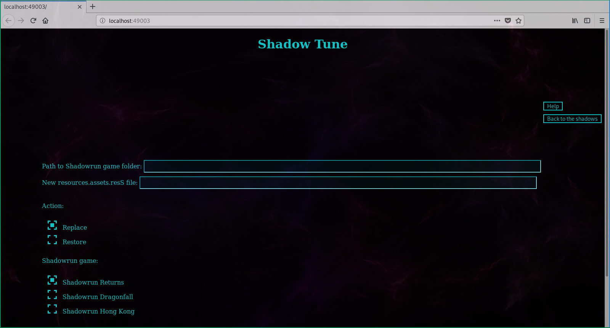
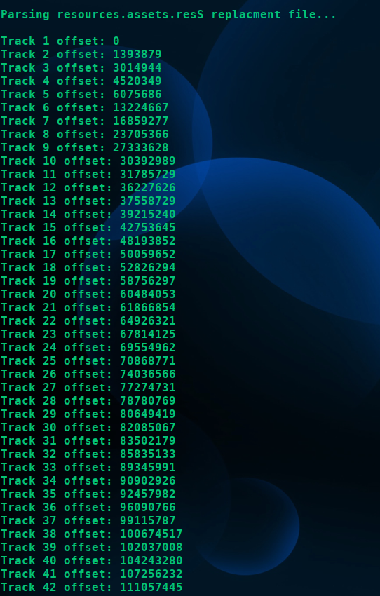
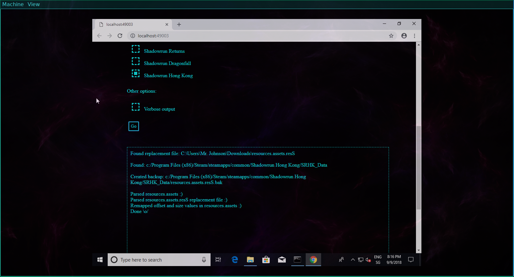

# Shadow-Tune
Perl script to swap out the soundtrack of Harebrained Scheme's Shadowrun games with custom music. 

[Prerequisites](#prerequisites)

[Installation](#installation)

[Usage](#usage)

[Screenshots](#screenshots)

[Limitations](#limitations)

## What is this exactly?
At its core, *Shadow-Tune* is a tool to manipulate the music resource files of the three
Shadowrun Games released by Harebrained Schemes:

- *Shadowrun Returns*
- *Shadowrun Dragonfall*
- *Shadowrun Hong Kong*

All three games store their music in a file named `resources.assets.resS`, with corresponding
metadata saved in another file labeled `resources.assets`. Users wishing to replace the soundtrack
with something else will have to overwrite the `resources.assets.resS` file with a new one and 
update the aforementioned metadata.

Shadow-Tune aims to automate this replacement process. However, it is **not** a music converter and it is
up to the user to provide a properly formatted `resources.assets.resS` file.

## Why does this exist?
Shadow-Tune 1.0 was originally developed as part of the effort to bring the Shadowrun Hong Kong mod *CalFree in Chains*
(which every self-respecting Shadowrunner should play if he/she/it hasn't already) to Linux platforms. The mod came with its
own soundtrack and a Linux-specific solution was needed to properly apply it and restore vanilla behavior once finished with the campaign.

Shadow-Tune 2.0 is the extended version of the original, capable of applying the same replacement operation to Shadowrun Returns
and Shadowrun Dragonfall as well. It is the hope of this particular decker that this script will be useful in some way to 
future users/modders and that we will see many new UGC campaigns in the years to come. Shadowrunners unite!

## Prerequisites
- A Perl interpreter, preferably `>= 5.26.2`.
Most Linux and Unix flavors should come with one pre-installed. Windows users might want to give Strawberry Perl or ActivePerl
a try. (**Note: At this point, Windows portability of the script is not guaranteed! See below for further info.**)

## Installation
Download the latest version from the [Release](https://github.com/Van-Ziegelstein/Shadow-Tune/releases) page or clone the repo. 
Don't forget to make the script executable after extraction! 

Only core modules were used, so no additional packages should have to be installed.

## Usage
The script can execute two kinds of operations:

#### -swap
Swap out the existing soundtrack with a new one. The format of the command is:

`shadow_tune.pl -swap <new-resources.assets.resS> [ <options> ]` 

Where `new-resources.assets.resS` is the path to a new resources.assets.resS file.
Before replacing the original, the script will make a backup copy that can later be used for the restore operation.

#### -restore
Revert back to the state prior to the sound modification. The format of the command is:

`shadow_tune.pl -restore [ <options> ]`

This operation will fail if the script can't locate the backup copy mentioned above.

#### Options:
Both operations can be supplemented with the following options:

`-e [ returns|dragonfall|hongkong| ]`

By default, the script will assume that its operations are to be carried out on the files of *Shadowrun Returns*. A different
game can be specified with this switch.

`-i  <path-to-shadowrun-install-folder>`

The script comes with some glob patterns that it uses to locate the Shadowrun games. It is not unlikely for this 
process to fail, though, and this commandline option can be used to manually point the script to the Shadowrun game that is to be modified. 

Pitfalls: 

-The path given with the `-i` switch should just lead to the root directory of the installation, e. g. 
`/some/folders/Shadowrun Dragonfall Director's Cut` or `/some/folders/Shadowrun Hong Kong`.

-The specified game directory must correspond to the game selected with the `-e` switch. (E.g. if **only** `-i`is used 
to point to the location of Shadowrun Dragonfall **without** setting `-e` to the appropriate value, the script will disgard
the path.)

`-v`

Obtain more verbose output.

## Screenshots

| Parsing resources.assets of Shadowrun Returns | Parsing a new resources.assets.resS file | Updating resources.assets of Shadowrun Hong Kong |
| --- | --- | --- |
|  |  | 

## Limitations
- The script provides no way of accessing and/or modifying individual music tracks, the only available operation
is bulk replacement of everything. This is because even the replacement of only a single track would boil down to
providing a modified `resources.assets.resS` file and performing a standard swap operation. (The number of tracks has to remain
constant otherwise the game will most certainly crash when loading nonexistent music data.)

- *Shadow-Tune* was originally developed in and for a Unix-like environment. Even with version 2.0 its roots are clearly visible
and this decker understands that it is a less than ideal tool for Windows users. Efforts are currently being made to account for
the entrails of a Windows environment but as of now portability is not guaranteed.

## Authors
**Van Ziegelstein** - Creator and Maintainer 

## Acknowledgments
Every Shadowrunner needs the right team for the job and *Shadow-Tune* wouldn't exist without the groundwork laid by two
particular runners:

**Zetor** - Performed the initial research into the sound resources of Shadowrun Returns and discovered how `resources.assets`
and `resources.assets.resS` were related.

**Cirion** - Creator of the UGC campaigns *Antumbra Saga*, *Caldecott Caper* and *CalFree in Chains*. Expanded Zetor's research
with regard to the audio format of `resources.assets.resS` and built the first music replacer for *Shadowrun Hong Kong*.

## License
This project is licensed under the [MIT License](LICENSE).
